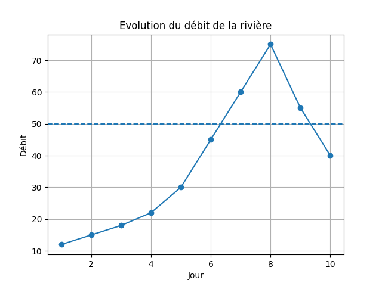
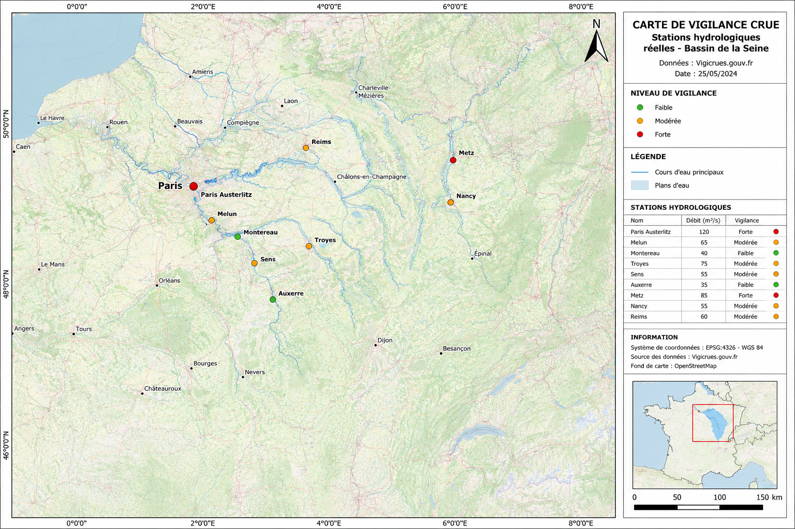

# Analyse hydrologique avec Python et QGIS

## I-Description de la partie python
Mini projet réalisé avec Python pour analyser des données hydrologiques simples dans le cadre d’un apprentissage en modélisation et prévision des crues.

Le projet permet :
- de lire des données de débit depuis un fichier CSV ;
- de calculer des statistiques simples ;
- de détecter des seuils de vigilance ;
- de générer une visualisation graphique des débits.

---

## Technologies utilisées
- Python
- pandas
- matplotlib

---

## Fonctionnalités
- Lecture de données hydrologiques
- Analyse statistique
- Détection automatique des jours critiques
- Génération d’un graphique des débits

---

## Fichiers du projet
- `analyse_crue.py` : script principal
- `donnees_crue.csv` : données hydrologiques
- `graphique_crue.png` : graphique généré automatiquement

---

## Exemple de résultat
Le script détecte les jours où le débit dépasse un seuil critique fixé à 50.

---


# Installation et exécution

## 1. Cloner le projet

```bash
git clone https://github.com/Lamessiogah/analyse_hydrologique_python.git
```

## 2. Entrer dans le dossier

```bash
cd analyse_hydrologique_python
```

## 3. Installer les dépendances

```bash
pip install pandas matplotlib
```

ou :

```bash
pip3 install pandas matplotlib
```

## 4. Exécuter le programme

```bash
python3 analyse_crue.py
```

---

## Résultat attendu

Le programme :
- affiche les statistiques hydrologiques ;
- détecte les jours de vigilance ;
- génère automatiquement un graphique :
  - `graphique_crue.png`
## Capture d’écran
### Exemple de sortie terminal

```bash
Analyse démarrée

Débit moyen : 37.2
Débit maximum : 75

Jours en vigilance :
   jour  debit
6     7     60
7     8     75
8     9     55

Graphique enregistré : graphique_crue.png
```


### Graphique généré



---
# II- Partie QGIS — Cartographie des stations hydrologiques

## Description
Une partie SIG (Système d’Information Géographique) a également été réalisée avec QGIS afin de spatialiser des stations hydrologiques réelles et représenter les niveaux de vigilance crue.

Cette carte permet :
- d’afficher des stations hydrologiques ;
- de visualiser les niveaux de vigilance ;
- de représenter spatialement les risques de crue ;
- de produire une carte thématique hydrologique.

---

## Technologies SIG utilisées
- QGIS
- OpenStreetMap
- Données CSV géolocalisées

---

## Fonctionnalités QGIS
- Importation de données géographiques réelles ;
- Cartographie de stations hydrologiques ;
- Classification des niveaux de vigilance ;
- Symbologie par niveau de risque ;
- Export d’une carte thématique.

---

## Fichiers SIG du projet
- `stations_reelles.csv` : stations hydrologiques géolocalisées
- `carte_vigilance_reelle.png` : carte SIG exportée depuis QGIS

---

## Exemple de stations utilisées

| Station | Débit | Vigilance |
|---|---|---|
| Paris Austerlitz | 120 | forte |
| Melun | 65 | moyenne |
| Montereau | 40 | faible |
| Metz | 85 | forte |
| Nancy | 55 | moyenne |

---

## Carte SIG générée



---
## Auteur
Lamessi Jérôme OGAH
